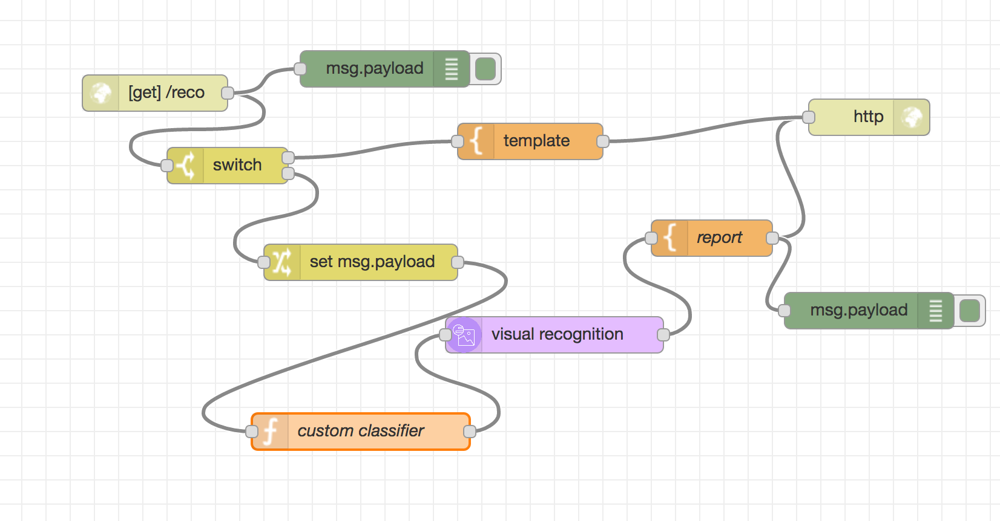
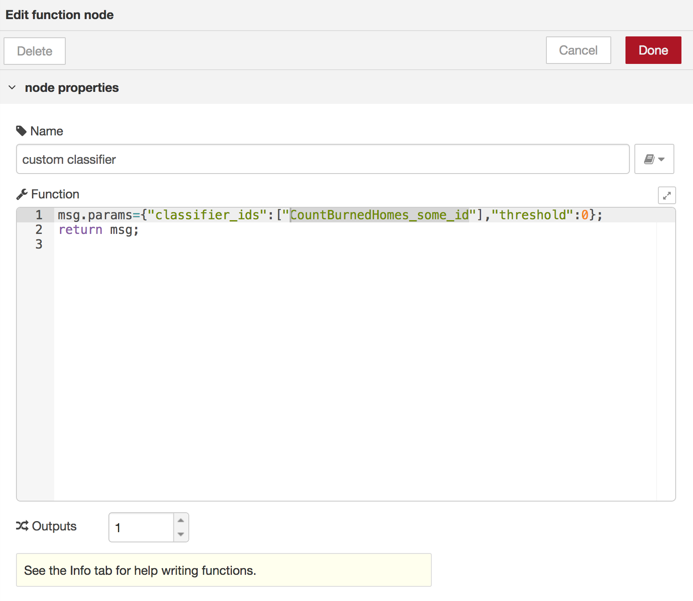

# ai visual recognition under 10min
let's create a custom classifier and run analysis with node.red on images.

## See this github here: http://ibm.biz/2019treehacks 

1. find [the drone based image classifier building with John Walicki](https://github.com/IBM/drones-iot-visual-recognition)
2. use [watson visual recognition in node.red](https://github.com/watson-developer-cloud/node-red-labs/tree/master/basic_examples/visual_recognition)
3. tweak it to use our custom model

add an additional `function` node - see the pic. 





Wire it together with the visual recogniton node.

add this code:

```js
msg.params={"classifier_ids":["CountBurnedHomes_some_id"],"threshold":0};
return msg;
```

And you should be good to test it on image like this one: https://i.dailymail.co.uk/i/newpix/2018/08/10/00/4EF8313400000578-0-image-a-11_1533857657594.jpg (this is such an unhappy picture, that please give a thought to displaced people in Nothern California, and other places affected by disasters. Do [Call for Code!](http://callforcode.org/) ).

If you like give me a star. Follow me on Twitter: [blumareks](http://twitter.com/blumareks).
BTW. I have a blog. Check it out [my blog on medium](https://medium.com/@blumareks) .
